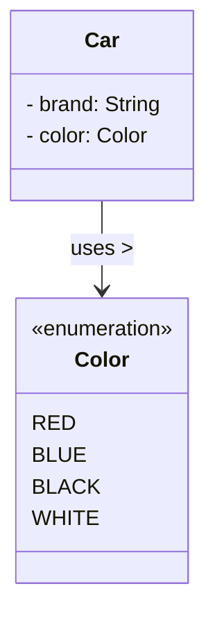
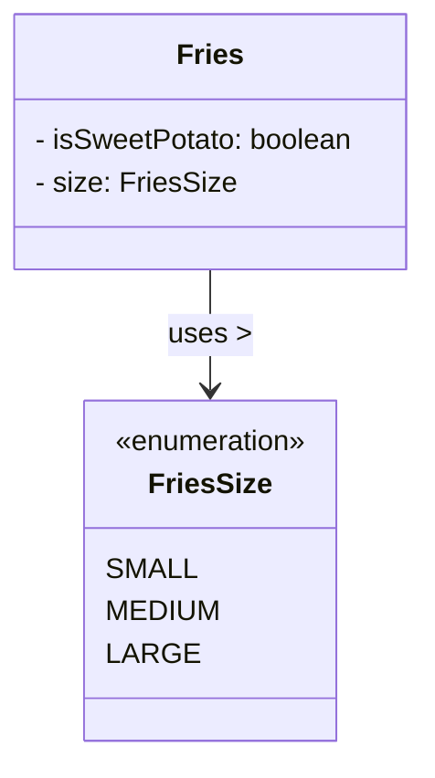
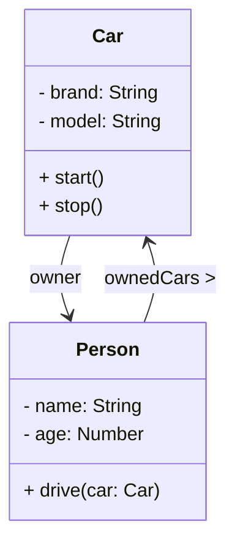

# Object-Oriented Programming (OOP)

# 📑 Table of Contents

- [What Is OOP?](#what-is-oop)
- [Why do we use OOP?](#why-do-we-use-oop)
- [OOP Key Concepts](#oop-key-concepts)
- [Objects and Classes](#objects-and-classes)
    - [Class → The Blueprint](#class--the-blueprint)
    - [Object](#object)
    - [Fields — Object Properties](#-fields--object-properties)
    - [Methods — Object Behaviors](#-methods--object-behaviors)
    - [Constructor — Building the Object](#constructor--building-the-object)
    - [Static Fields — Shared Data](#static-fields--shared-data)
    - [Static Methods — Class-Level Actions](#static-methods--classlevel-actions)
    - [Object Relationships in OOP](#object-relationships-in-oop)
        - [Focus on Association](#focus-on-association--general-relationship-between-objects)
- [Encapsulation](#encapsulation)
- [Inheritance](#inheritance)
- [Polymorphism — One Action, Many Forms](#polymorphism--one-action-many-forms)
    - [Method Overriding](#method-overriding)
    - [Method Overloading](#method-overloading)
- [Abstraction — Hiding Complexity](#abstraction--hiding-complexity)
    - [Abstract Classes — Partial Blueprints](#abstract-classes--partial-blueprints)
    - [Interfaces — Behavioral Contracts](#interfaces--behavioral-contracts)
- [Summary Table](#-summary-table)

---

# What Is OOP?

**Object-Oriented Programming (OOP)** is a programming paradigm where software is structured around
objects—self-contained units that bundle together:

- **Data** → things an object has (fields)
- **Behavior** → things an object can do (methods)

Instead of writing code as a long sequence of functions, OOP organizes programs around real-world or conceptual
“things,” making software more intuitive and maintainable.

Object-Oriented Programming is a way of designing software by organizing it around **objects**—things that hold **data**
and **behaviors**.
Instead of focusing only on functions or logic, OOP focuses on **real-world entities**.

## Why do we use OOP?

OOP helps us:

* **Model real-world systems easily** (cars, users, bookings)
* **Reuse code** (inherit behavior instead of rewriting it)
* **Protect data** (encapsulation)
* **Extend functionality safely** (polymorphism & inheritance)
* **Simplify complex systems** (abstraction)

---

## OOP Key Concepts

- Objects & Classes
- Encapsulation
- Inheritance
- Polymorphism
    - Overloading
    - Overriding
- Abstraction
    - Classes
    - Interfaces

# Objects and Classes

**Object-Oriented Programming (OOP)** is a programming paradigm that organizes software around **objects**
—self-contained units that contain both **data** and **behavior**.

- **Data (State):** the attributes or characteristics of an object.
- **Behavior (Methods):** the actions an object can perform.

OOP is commonly used to model real-world concepts.   
When we observe the world around us, we see many things—both **physical** and **conceptual**—that fit naturally into an
object-based structure.

## Types of Objects in OOP

Objects in OOP can represent either **physical** things or **logical** (conceptual) entities such as users, books,
booking or addresses.

### Physical Objects

These are tangible things we can observe in real life:

- House
- Car
- Student
- Phone

### Logical / Conceptual Objects

These represent ideas or processes within a system:

- Address
- Booking
- Account
- Order
- Notification

Even though conceptual objects are not physical, they still combine **data + behavior**, which makes them suitable for
OOP modeling.

---

## Relationships Between Objects

Objects often interact or depend on one another, just like in the real world.   
These relationships help a program reflect meaningful connections within a system.

Examples:

- A **Car** has an **Owner**.
- A **Book** is borrowed by a **User**.
- A **Student** enrolls in a **Course**.

Such relationships allow OOP to mirror real-world structures, making software more intuitive, modular, and maintainable.

**To model real-world entities, we create a class — the blueprint of an object**

---

## Class → The Blueprint


A **class** is a template or blueprint for creating objects.
Class describes the **behavior** and **properties** of an object.

* **Fields** → data stored in the object (brand, model, color, year)
* **Methods** → actions the object can perform (start(), stop(), accelerate())
* **Constructors** → how the car object is created and initialized

### Class Template

```java
class ClassName {
    // fields
    // constructors
    // methods
}
```

---

## Object


An **object** is an **instance** created from a class.
If a class is the design, an object is the actual car you can drive.

* `Car` → class
* `Volvo XC90`, `ID4 GTX` → objects created from the class

---

## 📦 Fields — Object Properties

Fields store **data unique to each object**.

* brand
* model
* color
* year

### Java Example

```java
class Car {
    String brand;
    String model;
    String color;
    int year;
}

```

---

## 🛠 Methods — Object Behaviors

Methods represent the **actions** an object can take.

* startEngine()
* accelerate()
* brake()
* honk()

---

## Constructor — Building the Object

Constructors set the **initial values** when a new car object is created.

```java
class Car {
    String brand;
    String model;
    String color;
    int year;

    Car(String brand, String model, String color, int year) {
        this.brand = brand;
        this.model = model;
        this.color = color;
        this.year = year;
    }
}
````

---

## Static Fields — Shared Data

A **static field** belongs to the class, not the object.
Example: `MAX_SPEED`
---

## Static Methods — Class‑Level Actions

Static methods can be used without creating an object.

Example: `printCarRules()`

---

## Enum — Fixed Set of Constants

An **enum** (enumeration) is a special data type that represents a **fixed set of constant values**.
Enums help make code more readable, type-safe, and error-proof.

### Why Use Enums?

- Prevent invalid values
- Improve code readability
- Replace magic strings or numbers
- Provide clear, predefined options

### Example: Car Colors

```java
enum Color {
    RED,
    BLUE,
    BLACK,
    WHITE
}

class Car {
    private String brand;
    private Color color;  // using enum type

    Car(String brand, Color color) {
        this.brand = brand;
        this.color = color;
    }
}
```

### Example: Burger Size

```java
enum FriesSize {
    SMALL, MEDIUM, LARGE
}
```



---



---

#### Object Relationships in OOP

Objects in a system often interact with other objects. These relationships help model how real-world entities connect,
depend on, or contain one another.

The three most common types of relationships are:

- **Association**
- Aggregation
- Composition

---

Association is a basic connection between two objects where they interact or know about each other.

- A **Car** has an **Owner**
- A **Book** is borrowed by a **User**
- A **Teacher** teaches a **Student**



---

# Encapsulation

**Encapsulation** means hiding internal details and exposing only what is necessary.
Encapsulation is a principle that protects an object’s data by hiding its internal details and only exposing what is
necessary.  
It keeps the object safe, controlled, and easy to maintain.


### Why Encapsulation?

* **Data Protection**: Internal object data is securely hidden from external access
* **Integrity Management**: Only carefully designed, safe methods are exposed for data interaction
* **Controlled Access**: Changes to object data are regulated through getters/setters and validation
* **Maintainability**: Encapsulation makes the code easier to modify and maintain over time
* **Reduced Complexity**: Implementation details are hidden, providing a cleaner interface

#### To implement Encapsulation:

- Make fields private → they cannot be accessed directly from outside the class.
- Provide public methods (getters/setters or other methods) to read/change that data safely.
- Optionally add validation in setters to protect the object from invalid data.

### Example

```java
class BankAccount {
    // Private fields (data is hidden)
    private double balance;
    private String ownerName;
    
    // Public constructor to set initial state
    public BankAccount(String ownerName, double initialBalance) {
        this.ownerName = ownerName;
        this.deposit(initialBalance);
    }
    // Public getter/setter/methods to modify state (with validation)
    public void setOwnerName(String ownerName) {
        if (ownerName == null || ownerName.isEmpty()) {
            throw new IllegalArgumentException("Owner name cannot be empty");
        } else {
            this.ownerName = ownerName;
        }
    }
    
    public String getOwnerName() {
        return ownerName;
    }

    public void deposit(double amount) {
        balance += amount;
    }

    public double getBalance() {
        return balance;
    }
}
```

---

# Inheritance

Inheritance allows a class to **acquire fields and methods** from another class.
Inheritance is an OOP principle that allows one class to reuse, extend, or modify the behavior and properties of another
class

It creates a **parent–child relationship** between classes:

- The parent class (superclass/base class) defines common attributes and behaviors that can be shared
- The child class (subclass/derived class) inherits everything from the parent and can:
    - Add new fields and methods
    - Override existing methods to change behavior
    - Access parent members through 'super' keyword

This creates clean, hierarchical code organization while promoting reusability and extensibility.


## Why Inheritance Is Useful

- **Reusability:** You don’t need to rewrite existing code.
- **Extensibility:** You can add new features to the child class.
- **Maintainability:** Changes to the parent automatically apply to all children.
- **Hierarchy Modeling:** Helps represent real-world *"is-a"* relationships.

---

## The “IS-A” Relationship

Inheritance is used when one class **“is a”** type of another.
When there is a relationship between two classes, that can be modeled as a hierarchy.

- A **Dog** *is an* **Animal**
- A **Car** *is a* **Vehicle**
- A **Teacher** *is a* **Person**
- An **Burger** *is a* **Food Item**
- A **Pizza** *is a* **Food Item**

### 🚀 How to Use Inheritance in Java

Java uses the `extends` keyword to create **inheritance**, allowing one class to reuse and build upon another.

- **Parent Class (Superclass):** the existing class that provides common fields and methods
- **Child Class (Subclass):** the new class that inherits from the superclass and can add or override behaviors

In simple terms:

**Subclass** → *extends* → **Superclass**

```java
class Parent {
    // fields and methods  
}

class Child extends Parent {
    // inherits parent's fields and methods  
    // can add new behaviors or override existing ones  
}
```
## 🍽 Real-World Scenario: Inheritance in a Food Ordering System

Imagine you are developing a **food ordering platform** for a restaurant or delivery service.  
The system must handle different types of menu items—burgers, pizzas, fries—each with unique options, but all sharing some common characteristics.

---

### **Item (Parent Class)**

Every menu item in the system has **shared properties**:

- `name` — the item name shown to customers
- `price` — the base cost of the item

And they also share **common behaviors**:

- `displayInfo()` — shows item details on the menu
- `calculateTax()` — applies tax based on restaurant rules

Since all food items share these features, we define a **general `Item` superclass**.

---

### **Burger (Child Class)**

A **Burger** is a specific type of Item and therefore *inherits* all Item fields and behaviors.

But in a real ordering system, burgers include additional customizations:

- `extraCheese` — customer chooses true/false
- `cookLevel` — rare / medium / well-done

These features do **not** apply to all food items, so Burger defines them itself.

---

### **Pizza (Child Class)**

Pizza also inherits from `Item`, but has different customization needs:

- `toppings` — list of added ingredients
- `size` — small / medium / large

Each pizza ordered may have unique combinations of toppings and sizes.

---

### **Fries (Child Class)**

Fries again extend the `Item` superclass but define their own special options:

- `size` — regular / large
- `seasoning` — salted / spicy / smoky, etc.

These options affect the price calculation and must be modeled separately.

---

### Why Inheritance?

By using inheritance:

- You avoid repeating `name`, `price`, `displayInfo()`, and `calculateTax()` in every food class
- Each subclass adds only what makes it **unique**
- The system becomes **easier to maintain**, **extend**, and **understand**

This mirrors how real ordering apps (like UberEats or DoorDash) structure their menu logic behind the scenes.

---

# Polymorphism — One Action, Many Forms

Polymorphism is the ability of a single action to produce multiple results.  
It allows the **same method call** to produce **different behaviors** depending on the object.

In simple terms:  
> **The same action behaves differently across different objects.**

Polymorphism is one of the core principles of OOP and is achieved in Java through:

- **Method Overriding** → Runtime Polymorphism
- **Method Overloading** → Compile-time Polymorphism

---

## 🔹 Method Overriding (Runtime Polymorphism)

A **subclass provides its own version** of a method that already exists in the parent class.

This allows each child class to behave differently even when using the same method name.

### Example

```java
class Item {
    void displayInfo() {
        System.out.println("Generic item information.");
    }
}

class Burger extends Item {

    @Override
    void displayInfo() {
        System.out.println("Burger: includes extra cheese option.");
    }

}

class Pizza extends Item {
    @Override
    void displayInfo() {
        System.out.println("Pizza: available in multiple sizes and toppings.");
    }
}


void main(){
    Item item1 = new Burger();
    Item item2 = new Pizza();

    item1.displayInfo();   // Burger version runs
    item2.displayInfo();   // Pizza version runs
}
```

---

## Method Overloading (Compile-Time Polymorphism)

Method overloading happens when multiple methods share the same name but differ in:
- number of parameters
- type of parameters
- order of parameters

### Example

```java
int add(int a, int b) {
    return a + b;
}

double add(double a, double b, double c) {
    return a + b + c;
}

int add(int... numbers) {
    int sum = 0;
    for (int n : numbers) sum += n;
    return sum;
}

```

| Type of Polymorphism      | Technique   | When It Happens | Example                                       |
|---------------------------|-------------|-----------------|-----------------------------------------------|
| Runtime Polymorphism      | Overriding  | At runtime      | Same method, different behavior in subclasses |
| Compile-Time Polymorphism | Overloading | At compile time | Same method name, different parameter lists   |

---

# Abstraction — Hiding Complexity

**Abstraction** means showing only the *essential features* of something while hiding the complex internal details.

It focuses on **what** an object does, not **how** it does it.

In a food ordering system, customers don’t need to know:

- how the burger is cooked internally
- how the pizza oven works
- how taxes are calculated

They just call a simple method like `prepare()` or `calculateTotal()`.

This is the core idea of abstraction.

---

## Abstract Classes — Partial Blueprints

An **abstract class** is a class that:

- **cannot be instantiated**
- may contain both **abstract methods** (no implementation) and **normal methods**
- is meant to be **inherited** by subclasses

It provides a *partial blueprint*, allowing subclasses to fill in the missing details.

Think of **Item** as a general food item:

- All food items have a name and price
- All food items calculate tax
- But **each food item calculates tax differently** (Burger vs Pizza vs Fries)

So the parent class defines *the idea*, but not *the exact implementation*.

```java
abstract class Item {
    private String name;
    private double price;

    Item(String name, double price) {
        this.name = name;
        this.price = price;
    }

    // abstract method ← must be implemented by subclasses
    abstract double calculateTax();

    // regular method ← shared by all items
    void displayInfo() {
        System.out.println(name + " costs " + price + " USD");
    }

}

class Burger extends Item {
    private boolean extraCheese;

    Burger(String name, double price, boolean extraCheese) {
        super(name, price);
        this.extraCheese = extraCheese;
    }

    @Override
    double calculateTax() {
        // calculate tax
        return price * 0.1;
    }
}

void main() {
    Item burger = new Burger("Cheese Burger", 10.0, true);
    burger.displayInfo();
    System.out.println("Tax: " + burger.calculateTax());
}
```

---

## Interfaces — Behavioral Contracts

An interface defines what behaviors a class must implement—but not how.
It contains only:

* **method signatures**
* **constants (optional)**

Interfaces support multiple inheritance, meaning a class can implement many of them.

A restaurant item could support multiple behaviors:

- It might be Deliverable
- It might be Discountable
- It might be Customizable

Each behavior can be defined as an interface.

```java
interface OrderItem {
    void addItem(Item Item);

    Item[] getItems();

    double getTotalPrice();

    void removeItem(Item Item);

    void clear();
}

class OrderItemImpl implements OrderItem {

    private Item[] items;

    @Override
    public void addItem(Item item) {
        // ...
    }

    //...
}
```

# 📝 Summary Table

| Concept        | Explanation                                              |
|----------------|----------------------------------------------------------|
| Class          | Blueprint for creating objects                           |
| Object         | Real instance of a class                                 |
| Fields         | Data stored in an object                                 |
| Methods        | Actions an object can perform                            |
| Constructor    | Initializes a new object                                 |
| Static Field   | Shared value across all instances                        |
| Static Method  | Method belonging to the class, not objects               |
| Encapsulation  | Restricting access to internal data                      |
| Inheritance    | Reusing and extending behavior                           |
| Polymorphism   | Same method call, different behavior                     |
| Overloading    | Multiple methods with same name but different parameters |
| Overriding     | Redefining a parent method in a subclass                 |
| Abstraction    | Showing essential features, hiding details               |
| Abstract Class | Blueprint with partial implementation                    |
| Interface      | Contract defining required behaviors                     |

---

| Feature                         | Abstract Class    | Interface                    |
|---------------------------------|-------------------|------------------------------|
| Contains fields                 | ✔ Yes             | ❌ No (except constants)      |
| Contains method implementations | ✔ Yes             | ✔ Default methods only       |
| Can be instantiated             | ❌ No              | ❌ No                         |
| Can have constructors           | ✔ Yes             | ❌ No                         |
| Multiple inheritance support    | ❌ No              | ✔ Yes                        |
| Use case                        | Shared base logic | Shared behavior across types |

---

