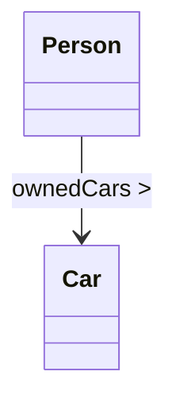
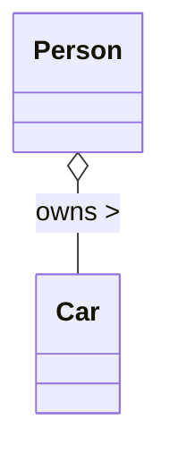
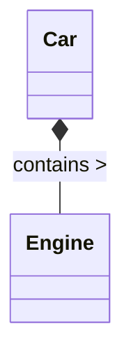
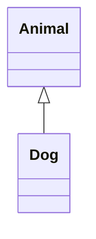
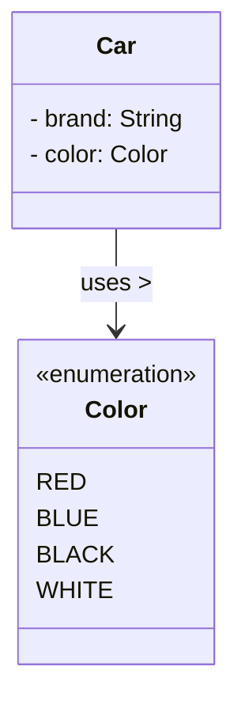
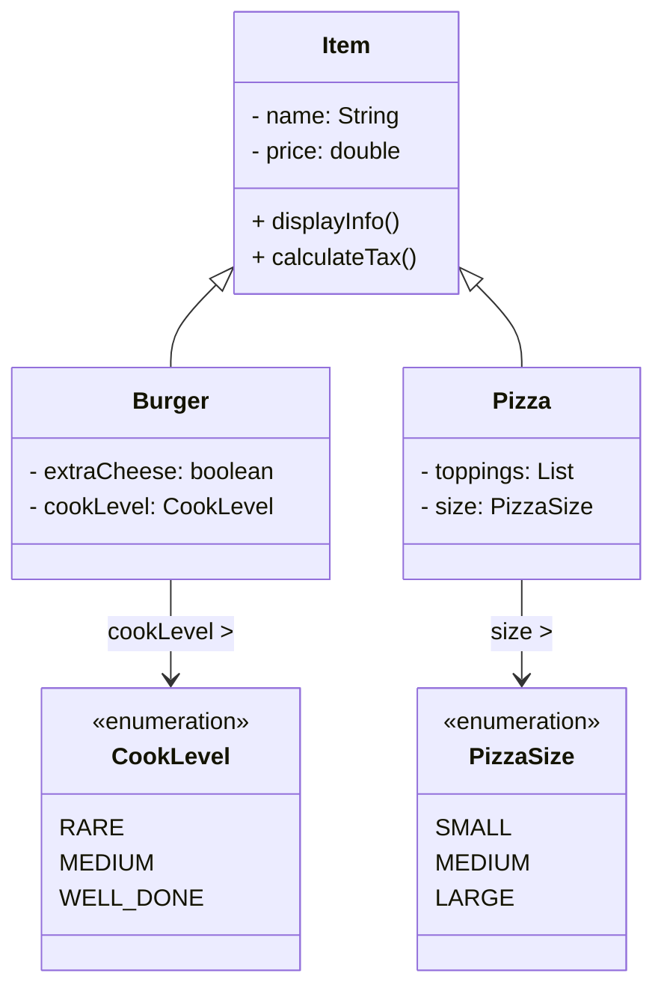

# 📘 What Is a UML Class Diagram?

A **UML Class Diagram** is one of the core diagram types in the **Unified Modeling Language (UML)**—a standardized visual language used to design and model software systems.

UML helps developers, designers, and architects represent complex software structures in a clear, visual way.

---

## 📑 Types of UML Diagrams

UML is divided into **Structural** and **Behavioral** categories.  
Class Diagrams belong to Structural UML.

### 🧱 Structural UML Diagrams (Static Structure)

1. **Class Diagram** — Shows classes, attributes, methods, and relationships.
2. **Object Diagram** — Snapshot of objects and their values at a specific time.
3. **Component Diagram** — Organization of software components.
4. **Deployment Diagram** — Hardware nodes and how software is deployed.
5. **Package Diagram** — Groups and organizes classes or packages.
6. **Composite Structure Diagram** — Internal structure of a class.
7. **Profile Diagram** — Custom extensions to UML (stereotypes, constraints).

---

### 🎭 Behavioral UML Diagrams (System Behavior)

1. **Use Case Diagram** — User goals and system interaction.
2. **Sequence Diagram** — Order of messages between objects.
3. **Activity Diagram** — Workflows or business logic.
4. **State Machine Diagram** — Object states and transitions.
5. **Communication Diagram** — Interactions between objects (like sequence but structural).
6. **Interaction Overview Diagram** — High-level overview of interactions.
7. **Timing Diagram** — Time-based behaviors.

---

# 🧱 What Is a Class Diagram?

A **Class Diagram** focuses on the *static structure* of a system.  
It shows:

- **Classes** (blueprints of objects)
- **Attributes** (data fields)
- **Methods** (behaviors/functions)
- **Relationships between classes**  
  such as association, inheritance, aggregation, and composition

Class diagrams help answer questions like:

- *What objects exist in the system?*
- *What data do they store?*
- *How do objects interact?*
- *Which classes depend on others?*
- *How is the system structured at a high level?*

---

# 🎯 Why Class Diagrams Are Important

They help:

- Provide a **blueprint** for code
- Encourage discussion before implementation
- Reduce misunderstandings within teams
- Reveal missing or unnecessary components
- Improve system structure and maintainability

---

# 🧩 Class Diagram in Practice

Class diagrams are especially useful for:

- Learning Object-Oriented Programming (OOP)
- Planning new system features
- Designing architecture
- Communicating with development teams
- Documentation and long-term maintenance

> **A UML Class Diagram is the foundation for designing clear, scalable, object-oriented systems.**

---

# 🧱 UML Class Diagram Notations

Understanding UML symbols is essential before creating or reading diagrams.

---

## 🧱 1. Class Structure Notation

A UML class contains three sections:

```
-------------------------
|     ClassName         |
-------------------------
| + attribute: Type     |
| - attribute: Type     |
| # attribute: Type     |
-------------------------
| + method(): return    |
| - method(param): T    |
-------------------------
```

### UML Visibility Symbols

| Symbol | Meaning         |
|--------|-----------------|
| `+`    | Public          |
| `-`    | Private         |
| `#`    | Protected       |
| `~`    | Package-private |

---

# 🧱 2. Relationship Notations

UML class diagrams show different kinds of relationships between classes:

---

## 🔹 Association (`-->`)



---

## 🔹 Aggregation (`o--`)



---

## 🔹 Composition (`*--`)



---

## 🔹 Inheritance (`<|--`)



---

## 🔹 Enumeration (`<<enumeration>>`)



---

# 🍕 Food Ordering Example



---

| Notation          | Meaning          |
|-------------------|------------------|
| `+`               | Public           |
| `-`               | Private          |
| `#`               | Protected        |
| `~`               | Package-private  |
| `<\|--`           | Inheritance      |
| `-->`             | Association      |
| `o--`             | Aggregation      |
| `*--`             | Composition      |
| `..>`             | Dependency       |
| `<<enumeration>>` | Enumeration type |

---
